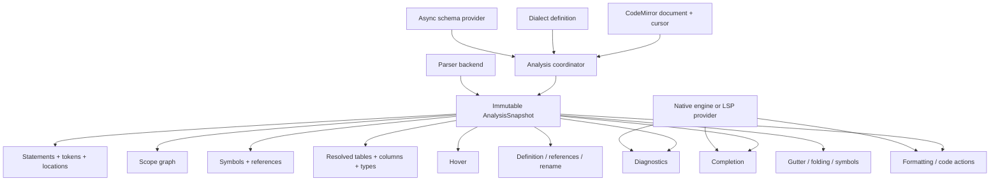

# SQL Editor Research and Gap Analysis

Date: 2026-07-24

## Executive summary

The repository has a strong foundation, especially after v0.3.0, but the
investigation found several confirmed correctness bugs and one potential
security issue.

The biggest strategic limitation is that most semantic features are built
around a flat, mostly location-free `node-sql-parser` AST. This makes nested
scopes, accurately positioned diagnostics, dialect fidelity, and multi-catalog
completion harder than they need to be.

The recommended sequence is:

1. Ship a correctness and security release.
2. Consolidate parsing and semantic analysis around a shared, location-aware
   document model.
3. Build richer completion, schema, formatting, and language-server features on
   that model.

## Highest-priority findings

### P0: Escape all default hover content

Default tooltips assemble schema and keyword metadata as HTML and assign it
through `innerHTML`. Table names, column names, completion `detail` and `info`,
keyword descriptions, examples, and metadata are not escaped.

Relevant code:

- `src/sql/hover.ts`, around the tooltip DOM construction and `innerHTML`
  assignment.
- `src/sql/hover.ts`, in `createNamespaceTooltip`,
  `createKeywordTooltip`, `createTableTooltip`, and `createColumnTooltip`.

If schema descriptions or completion metadata originate from a database or
service, crafted values could inject markup or script-capable elements into the
host application.

Recommended fix:

- Build default tooltips with DOM nodes and `textContent`, or escape every value
  used by the default renderers.
- Document whether custom renderers return trusted HTML or plain text.
- Add hostile table, column, description, and metadata tests.

### P1: BigQuery dialect construction is incorrect

`src/dialects/bigquery.ts` spreads the `PostgreSQL` dialect object rather than
`PostgreSQL.spec`:

```ts
const BigQuery: SQLDialectSpec = {
  ...PostgreSQL,
  caseInsensitiveIdentifiers: true,
  identifierQuotes: "`",
};
```

Runtime inspection confirmed:

- PostgreSQL has 831 registered words.
- `BigQueryDialect` has only 295, corresponding to the standard defaults.
- BigQuery-relevant items such as `QUALIFY` are absent.

At minimum, this should spread `PostgreSQL.spec`. Preferably, the project should
generate and maintain a real BigQuery dialect spec rather than describing it as
a PostgreSQL wrapper.

The earlier marimo
[BigQuery quoting report](https://github.com/marimo-team/marimo/issues/5419)
also illustrates why dialect-specific quoting and completion need to be
accurate.

### P1: The statement splitter corrupts valid SQL

The custom scanner in `src/sql/structure-analyzer.ts` understands single,
double, and backtick quotes plus comments, but not:

- PostgreSQL dollar-quoted strings
- MSSQL bracket-quoted identifiers
- Backslash escape modes
- Procedural `BEGIN ... END` bodies
- Custom delimiters
- Some dialect-specific multiline strings

The following was reproduced:

```sql
SELECT $$a;b$$; SELECT [x;y] FROM t; SELECT 3
```

It was split into:

```text
SELECT $$a
b$$
SELECT [x
y] FROM t
SELECT 3
```

This affects linting, gutter state, hover scope, completion, and navigation
simultaneously.

Recommended fix:

- Obtain statement boundaries from a tokenizer, parser, or CodeMirror syntax
  tree.
- Keep the scanner only as a documented fallback.
- Add a dialect-specific statement-boundary corpus.

### P1: Semantic diagnostics can point to the wrong text or disappear

Semantic diagnostic locations are reconstructed by finding the first matching
identifier text in the statement. This can underline an occurrence inside a
comment or string rather than the real table or column reference.

Confirmed examples:

```sql
SELECT 'usres' AS note FROM usres
```

```sql
-- usres
SELECT * FROM usres
```

In both cases, the unknown-table diagnostic points to the first `usres`.

There is a second issue. `SqlStatement.content` has comments removed before
semantic re-parsing, but comment removal does not preserve whitespace. These
queries silently lose an expected unknown-column warning:

```sql
SELECT/*x*/bad FROM users
SELECT bad/*x*/FROM users
SELECT bad FROM/*x*/users
```

The original statement parses, but semantic analysis reparses concatenated text
such as `SELECTbad`.

Recommended fix:

- Store the original statement source and parsed AST on `SqlStatement`.
- Preserve source locations from the parser.
- Never reparse comment-stripped display content.
- Mask comments with spaces when offsets must be preserved.

### P1: Nested query scopes leak into completion

`walkAst` flattens tables from every nested query into one `QueryContext`.
Unqualified completion then iterates the entire flattened table list.

This outer-query completion was reproduced:

```sql
SELECT | FROM users
WHERE EXISTS (SELECT 1 FROM orders)
```

With a schema containing `user_col` and `order_col`, the outer completion
offered both. Only the columns of `users` are visible at that cursor.

The query model should become a scope tree containing:

- Parent and child scopes
- Exact source ranges
- Visible CTEs and aliases
- Derived-table output columns
- Correlation rules
- The innermost scope at a cursor position

This also provides a principled fix for alias shadowing and CTE visibility.

### P1: State-sensitive parser results are cached only by SQL text

Both `SqlStructureAnalyzer` and `QueryContextAnalyzer` cache by SQL text alone.
However, `NodeSqlParser.getParserOptions(state)` explicitly allows dialect and
parser options to depend on editor state.

A targeted reproduction analyzed identical SQL under two states with different
dialect facets. The parser was only called for the first state, and the second
state received the cached result.

Recommended fix:

- Add a parser/dialect/configuration identity to cache keys, or
- Invalidate analyzers when relevant facets change.

### P1: Async gutter results can arrive out of order

The gutter starts untracked asynchronous analysis after document, selection, or
focus changes and dispatches each result unconditionally. A slower result for an
older state can therefore overwrite the result for newer text.

Navigation already uses generation checks. The gutter should follow the same
pattern and verify that `view.state` still matches the captured state before
dispatching.

## Smaller confirmed issues

### A zero-millisecond lint delay is ignored

Both linters use:

```ts
delay: config.delay || DEFAULT_DELAY
```

As a result, `delay: 0` becomes the default delay. Use:

```ts
delay: config.delay ?? DEFAULT_DELAY
```

### Hover fuzzy-search documentation and behavior disagree

The `SqlHoverConfig` documentation says fuzzy matching defaults to `false`, but
`createHoverSource` defaults it to `true`.

One side should be changed and a default-behavior test added.

### Missing `@codemirror/lang-sql` peer dependency

The exported `./dialects` entry requires `@codemirror/lang-sql` at runtime, but
that package is only listed as a development dependency.

It should be a peer dependency, potentially optional if consumers who never
import `./dialects` should not be required to install it.

### DuckDB syntax can be declared valid without an AST

DuckDB statements beginning with `FROM` or containing `macro` are accepted
without an AST. This prevents false syntax errors, but it also silently disables
semantic linting, reliable hover, CTE analysis, and navigation for those
statements.

Validity and analyzability should be represented separately.

### The same document is parsed repeatedly

Linting, semantic linting, gutter analysis, completion, hover, and navigation
often own separate analyzers. Semantic linting additionally parses a valid
statement once in the structure analyzer and again for semantic checks.

A shared document-analysis service should provide:

- Statement boundaries
- Original source
- AST and tokens
- Source locations
- Scope information
- Parse diagnostics
- A state-sensitive cache identity

### Parser bundle size

The full local `node-sql-parser` installation occupied approximately 88 MB.
Its documentation says that the browser build containing all database parsers
is about 750 KB, versus about 150 KB for a specific database parser.

Per-dialect imports and parser adapters are worth investigating:

- [node-sql-parser documentation](https://www.npmjs.com/package/node-sql-parser)

## Features worth adding

### 1. Real cursor-scoped completion

Support:

- Nested and correlated subqueries
- Derived tables
- CTE `SELECT *` propagation
- `UNION` output schemas
- Correct catalog and schema search paths
- Temporary tables and views created in preceding statements

The open marimo report about completion with multiple DuckDB databases is
direct product evidence:

- [marimo #7499](https://github.com/marimo-team/marimo/issues/7499)

### 2. A richer schema model

The current `SQLNamespace` representation is useful for CodeMirror completion,
but advanced semantic features need more information:

- Catalog, schema, table, view, and function distinctions
- Column type, nullability, description, and completion metadata
- Primary and foreign keys
- Relationships
- Default catalog and schema
- Search path
- Asynchronous schema loading with caching and cancellation

An optional migration helper can convert `SQLNamespace` into this richer model,
but the new major should expose the richer model directly.

### 3. Grammar-aware completion

Add context-specific suggestions for:

- Expected keywords and entity kinds at the cursor
- Functions in expression positions
- `INSERT` target columns
- `UPDATE SET` columns
- `GROUP BY` and `ORDER BY` aliases and ordinals
- Dialect-correct quoting and casing

### 4. Higher-value editor actions

Potential features:

- Join-condition suggestions based on foreign keys
- Expand `*`
- Qualify ambiguous columns
- Generate table aliases
- Function signature help
- Document symbols and statement/CTE folding
- Go-to-definition for physical tables through a host callback

### 5. Formatting and lint code actions

Support:

- Format document
- Format selection
- Apply safe lint fixes
- Configurable keyword case and indentation
- Templating-aware regions for `{...}`, Jinja/dbt, and prepared placeholders

### 6. Parameter awareness

Recognize dialect-specific parameters:

- `?`
- `$1`
- `:name`
- `@name`

The extension should avoid treating parameters as identifiers and could expose
host callbacks for parameter metadata.

This complements marimo's prepared-statement discussion:

- [marimo #9445](https://github.com/marimo-team/marimo/issues/9445)

## Repositories and projects to study

### DTStack/dt-sql-parser and monaco-sql-languages

- [DTStack/dt-sql-parser](https://github.com/DTStack/dt-sql-parser)
- [DTStack/monaco-sql-languages](https://github.com/DTStack/monaco-sql-languages)

These are the strongest direct inspiration for grammar-aware completion.
`dt-sql-parser` returns expected keywords and entity kinds at the caret and
associates tables with statement contexts.

Its documentation also acknowledges limitations in nested subquery scenarios,
which is useful design guidance for a scope-tree implementation.

Limitations for this project's needs:

- Its documented dialects focus on MySQL, Flink, Spark, Hive, PostgreSQL,
  Trino, Impala, and generic SQL.
- It does not directly solve DuckDB or BigQuery support.

### SQLGlot

- [tobymao/sqlglot](https://github.com/tobymao/sqlglot)

SQLGlot is an excellent semantic reference implementation. It provides broad
dialect coverage, qualification, type annotation, star expansion, AST
transformations, and lineage.

Because it is Python, it is best considered as:

- A server-side `SqlParser` adapter for hosts such as marimo
- A correctness oracle
- A source of dialect and semantic test cases

It is not a direct browser dependency.

### DuckDB native autocomplete and DuckDB UI

- [DuckDB autocomplete extension](https://duckdb.org/docs/stable/core_extensions/autocomplete.html)
- [duckdb/duckdb-ui](https://github.com/duckdb/duckdb-ui)

For DuckDB, the strongest completion source is the actual engine through
`sql_auto_complete`. It knows attached catalogs and live schema state, which a
static browser parser cannot infer.

DuckDB UI is also useful architectural inspiration because its server API
supports SQL tokenization and catalog-update events.

A host integration could merge native DuckDB suggestions with local CodeMirror
suggestions.

### SQLFluff

- [sqlfluff/sqlfluff](https://github.com/sqlfluff/sqlfluff)

Study:

- Dialect and templating architecture
- Configurable lint rules
- Automatic fixes
- Behavior for incomplete and templated SQL
- Broad dialect test coverage

### sqruff

- [quarylabs/sqruff](https://github.com/quarylabs/sqruff)

sqruff is a fast Rust formatter and linter with a browser playground. It is
worth evaluating for either a browser/WASM adapter or a host-side lint and
formatting service.

### sql-formatter

- [sql-formatter-org/sql-formatter](https://github.com/sql-formatter-org/sql-formatter)

This is a practical TypeScript option for document and range formatting. It
supports many relevant dialects, configurable casing, and placeholders.

Its documented limitations include stored procedures and alternate delimiter
types, so integrations should retain escape hatches and avoid presenting it as
a full parser.

### Bytebase

- [bytebase/bytebase](https://github.com/bytebase/bytebase)
- [Bytebase SQL Editor documentation](https://docs.bytebase.com/sql-editor/run-queries)

Bytebase is primarily product-level inspiration:

- Inline schema details
- SQL review rules
- Visual `EXPLAIN`
- Statement access modes
- History and sharing
- AI-assisted explanation and problem finding

Not all of these belong in a CodeMirror package, but the package can provide the
editor primitives and host callbacks needed to build them.

### CodeMirror LSP client

- [CodeMirror LSP client reference](https://codemirror.net/docs/ref/#lsp-client)

Rather than implementing every IDE feature locally, the project should provide
a documented composition path for SQL language servers. This gives hosts a
route to:

- Formatting
- Document symbols
- Signature help
- Code actions
- Server-backed completion and diagnostics

## Recommended execution order

### Batch 1: Correctness and security release

1. Escape default hover content.
2. Fix BigQuery dialect construction.
3. Fix `delay: 0`.
4. Resolve the fuzzy-search default mismatch.
5. Add the missing peer dependency.
6. Add gutter generation and stale-state checks.
7. Add regression tests for each issue.

### Batch 2: Analysis-core refactor

Create one shared analysis result containing:

- Original source
- Statement boundaries
- AST
- Tokens and locations
- Query scopes
- Parse diagnostics
- Parser and dialect cache identity

Then:

1. Replace the manual statement splitter where possible.
2. Build a cursor-addressable scope tree.
3. Share analysis across all editor features.
4. Eliminate comment-stripped re-parsing and duplicate parsing.

### Batch 3: Feature release

1. Derived-table and CTE output propagation.
2. Multi-catalog and search-path completion.
3. Async rich schema model.
4. Formatting hooks.
5. LSP integration hooks.
6. Native-engine completion adapters, beginning with DuckDB.

## Verification performed

The repository was verified with:

```bash
pnpm test --run
pnpm run typecheck
pnpm exec oxlint
```

Results:

- 21 test files passed.
- 588 tests passed.
- 1 expected failure remained.
- Statement coverage was 93.54%.
- TypeScript typechecking passed.
- oxlint reported no warnings or errors.

The test suite is broad, but it should add adversarial coverage for:

- Dialect changes with unchanged document text
- Asynchronous analysis races
- Nested query scopes
- Hostile tooltip metadata
- Dollar-quoted and bracket-quoted semicolons
- Procedural statement bodies
- Comment-adjacent tokens
- Diagnostic locations when names also appear in strings and comments

## Architectural direction

The repository should make one major architectural shift: stop letting each
editor feature independently parse and interpret SQL. Instead, it should build
a shared SQL analysis platform and make linting, completion, hover, navigation,
and gutter rendering thin consumers of it.

The project is currently a collection of capable CodeMirror extensions. To
become an excellent SQL editor foundation, it should become a small language
service.

### Target architecture



### 1. Introduce a single immutable analysis snapshot

This is the most important refactor.

Every document version should produce one `AnalysisSnapshot`:

```ts
interface AnalysisSnapshot {
  documentVersion: number;
  dialectId: string;
  schemaVersion?: string;

  statements: SqlStatementNode[];
  tokens: SqlToken[];
  diagnostics: SqlDiagnostic[];
  scopeGraph: SqlScopeGraph;
  symbols: SqlSymbolTable;

  ast?: unknown;
  capabilities: AnalysisCapabilities;
}
```

Each analyzed statement should retain:

- Original source text
- Absolute document range
- Tokens and exact source locations
- Parsed AST
- Parse errors
- Root scope
- Statement type
- Whether the result is complete, recovered, or opaque

This would eliminate:

- Duplicate parsing
- Comment-stripped re-parsing
- Text-search diagnostic positioning
- Inconsistent interpretations between features
- Caches keyed only by SQL text

The current `SqlStructureAnalyzer`, `QueryContextAnalyzer`, and semantic AST
traversal should gradually collapse into this service.

### 2. Build a real scope graph

The semantic model should represent SQL lexical and relational scopes
explicitly rather than flattening them into one query context:

```ts
interface SqlScope {
  id: string;
  kind: "statement" | "select" | "cte" | "subquery" | "dml";
  range: SqlRange;
  parent?: string;

  sources: SqlRelation[];
  columns: SqlColumnBinding[];
  aliases: SqlSymbol[];
  ctes: SqlSymbol[];
  children: string[];
}
```

A scope graph unlocks:

- Correct completion inside nested subqueries
- Correlated-reference handling
- Alias shadowing
- Derived-table columns
- CTE output propagation
- Reliable rename and references
- Proper ambiguity diagnostics
- `UNION` output schemas
- Completion based on the cursor's exact scope

This semantic intermediate representation should be independent of
`node-sql-parser` AST shapes. Parser adapters should translate their ASTs into
the common model. This prevents a parser replacement from requiring every
editor feature to be rewritten.

### 3. Make parser backends capability-based

The current `SqlParser` interface implies that every parser can provide roughly
the same behavior. In practice, some DuckDB fallbacks can only establish
validity, while other dialects produce usable ASTs.

Capabilities should be explicit:

```ts
interface SqlParserBackend {
  readonly id: string;
  readonly dialects: readonly string[];

  analyze(
    document: string,
    options: AnalyzeOptions,
    signal: AbortSignal,
  ): Promise<ParserAnalysis>;
}

interface ParserAnalysis {
  statements?: ParsedStatement[];
  tokens?: SqlToken[];
  diagnostics: SqlDiagnostic[];
  ast?: unknown;

  capabilities: {
    exactLocations: boolean;
    recovery: boolean;
    scopes: boolean;
    formatting: boolean;
  };
}
```

The architecture could then support:

- `node-sql-parser` as the initial browser fallback
- Dialect-specific ANTLR parsers where valuable
- Native DuckDB completion and tokenization through a host
- SQLGlot through a server-side marimo adapter
- LSP-backed analysis
- Future WASM parsers

Features could degrade honestly based on capabilities instead of treating
"valid but no AST" as fully analyzed.

### 4. Make dialects first-class configurations

A dialect should be more than CodeMirror highlighting and a
`node-sql-parser` database name:

```ts
interface SqlDialectDefinition {
  id: string;
  codeMirrorDialect: SQLDialect;
  parserDialect: string;

  identifier: {
    quote: string;
    caseSensitivity: "sensitive" | "insensitive";
    normalization: (name: string, quoted: boolean) => string;
  };

  parameters: ParameterStyle[];
  statementRules: StatementBoundaryRules;
  keywords: KeywordCatalog;
  functions: FunctionCatalog;
  formatterDialect?: string;
}
```

A dialect registry should centralize:

- Quoting
- Identifier normalization
- Keywords, types, and functions
- Parameter syntax
- Parser selection
- Formatter selection
- Statement-boundary behavior
- Feature capability tests

Every dialect should have a conformance corpus containing valid, invalid,
incomplete, and multi-statement examples. BigQuery and DuckDB particularly need
this.

### 5. Replace `SQLNamespace` as the schema model

For the next major version, replace `SQLNamespace` at the public service
boundary rather than making it the permanent compatibility shape. Provide a
small, optional conversion helper for migrations, but make the richer catalog
graph the canonical API:

```ts
interface SqlCatalog {
  version: string;
  catalogs: SqlCatalogNode[];
}

interface SqlRelation {
  id: string;
  path: IdentifierPath;
  kind: "table" | "view" | "cte" | "derived" | "function";
  columns?: SqlColumn[];
}

interface SqlColumn {
  name: string;
  type?: SqlType;
  nullable?: boolean;
  description?: string;
  primaryKey?: boolean;
  references?: SqlColumnReference;
}
```

This enables:

- Join-condition suggestions
- Type-aware function completion
- Better hover content
- `*` expansion
- Type mismatch diagnostics
- Search paths
- Multiple catalogs containing identically named tables

Schema acquisition should be asynchronous and versioned:

```ts
interface SqlSchemaProvider {
  getCatalog(
    request: CatalogRequest,
    signal: AbortSignal,
  ): Promise<SqlCatalog>;

  search?(
    query: SchemaSearchRequest,
    signal: AbortSignal,
  ): Promise<SqlCatalogItem[]>;
}
```

Large databases should not require loading the entire catalog before the editor
works.

### 6. Add an analysis scheduler

Parsing should not run directly from every CodeMirror plugin. A scheduler
should provide:

- Document-version tracking
- Cancellation through `AbortSignal`
- In-flight request deduplication
- Stale-result rejection
- Debouncing by workload
- LRU analysis caching
- Optional Web Worker execution
- Performance instrumentation

Suggested behavior:

- Tokenization and statement boundaries: immediate
- Local completion scope: low latency
- Syntax diagnostics: debounced
- Semantic diagnostics: more heavily debounced
- Remote schema and native completion: cancellable
- Formatting: explicit only

For large SQL documents, worker execution will matter more than
micro-optimizing individual traversals.

### 7. Separate language intelligence from CodeMirror

The core should accept plain text, positions, dialect, and schema. It should not
require `EditorState`:

```ts
const snapshot = await languageService.analyze({
  text,
  version,
  dialect,
  schema,
  signal,
});

const completions = languageService.complete(snapshot, position);
const hover = languageService.hover(snapshot, position);
```

`src/codemirror/*` should adapt these results into CodeMirror extensions.

Benefits:

- Core behavior can be tested without DOM or CodeMirror fixtures.
- Monaco, textarea, CLI, and backend use become possible.
- Parser behavior no longer depends implicitly on arbitrary `EditorState`.
- Browser tests can focus on integration instead of semantic correctness.

### 8. Compose local, native-engine, and LSP providers

The package should not try to outperform a live database at understanding its
own dialect and catalog.

Support layered providers:

1. Return local snapshot results immediately.
2. Request native engine or LSP results asynchronously.
3. Merge and deduplicate results.
4. Prefer authoritative results when available.

For DuckDB:

- Local completion provides immediate keywords and obvious aliases.
- `sql_auto_complete` provides authoritative catalog-aware suggestions.
- Catalog-change events invalidate schema caches.

For marimo:

- A SQLGlot-backed service could provide broader dialect parsing and semantic
  analysis.
- The browser library should remain functional without a backend.

### 9. Modularize packaging after the core refactor

Avoid one mandatory package that ships every parser, dialect catalog, formatter,
and integration.

A possible package or subpath-export structure is:

```text
@marimo-team/codemirror-sql
  /core
  /codemirror
  /dialects
  /parsers/node-sql-parser
  /providers/lsp
  /providers/duckdb
  /formatters/sql-formatter
```

Goals:

- Core completion users do not pay for semantic linting.
- DuckDB users do not bundle every `node-sql-parser` dialect.
- Formatter and LSP dependencies remain optional.
- Tree-shaking does not depend on dynamic-import heuristics.

### What not to do

Avoid:

- Replacing `node-sql-parser` before defining the common semantic model. That
  changes the dependency without fixing the architecture.
- Adding more regular expressions to repair nested scopes and statement
  boundaries.
- Expanding `QueryContext` into an ever-larger flat structure.
- Making `SQLNamespace` carry every future semantic concern.
- Letting each feature accept independently configured parsers and analyzers
  indefinitely.
- Building formatting, lint rules, and LSP behavior directly into CodeMirror
  plugins.

### Practical overhaul plan

#### Phase 1: Stabilize

Fix the security and correctness findings earlier in this document.

#### Phase 2: Build the new core behind a new-major entry point

Add:

```text
src/core/analysis-snapshot.ts
src/core/language-service.ts
src/core/scope-graph.ts
src/core/schema-model.ts
src/core/dialect.ts
src/core/scheduler.ts
src/parsers/node-sql-parser-adapter.ts
```

Reuse existing implementation details only when they satisfy the new contracts.
Do not expose the old analyzer types through the new entry point.

#### Phase 3: Replace features with vertical slices

Recommended order:

1. Gutter and statement selection
2. Syntax diagnostics
3. Completion
4. Hover
5. Navigation
6. Semantic diagnostics

Remove `SqlStructureAnalyzer`, `QueryContextAnalyzer`, and the old feature
configuration surface before the new major release. The new implementation
does not need to coexist with them in the published API.

#### Phase 4: Add richer backends and features

- DuckDB native provider
- SQLGlot server adapter
- LSP provider
- Formatter provider
- Rich schema and relationship completion

The architectural north star is:

> One document version, one semantic interpretation, many editor features.

## Independent design review and consolidated direction

This section records a second-pass review of the findings and architecture
above. Three independent reviews were performed with different priorities:

1. Language-tooling architecture, correctness, concurrency, and performance
2. Source-level comparison with the upstream projects named in this report
3. The way marimo currently consumes this package in a real application

The original architectural diagnosis survives review: this project should grow
from a collection of CodeMirror features into a shared SQL language service.
However, the reviewers agreed that the proposed single, eager
`AnalysisSnapshot` is the wrong implementation boundary. Data at different
levels has different dependencies, latency, authority, and invalidation rules.

The revised north star is:

> One versioned document and context model, reusable statement-level analysis,
> explicit semantic scopes, and independently cancellable consumers and
> authoritative providers.

### Major-version assumption

The remainder of this recommendation assumes the overhaul can ship as the next
major version, with breaking API and behavior changes. Backward compatibility
is not an architectural goal.

That means the project should:

- Replace the existing parser/analyzer/configuration API instead of wrapping it
  indefinitely.
- Remove obsolete public implementation classes from the new entry point.
- Make rich catalog, dialect, validation, templating, and provider contracts
  canonical from day one.
- Choose secure renderers and conservative feature defaults even when this
  changes existing behavior.
- Change lint granularity and scheduling only through explicit new contracts.
- Update marimo as the reference migration while the new API is still fluid.

It should still ship a migration guide, codemod or conversion helpers where
cheap, and integration tests for important consumers. Those protect users from
undocumented or silent changes; they do not constrain the new architecture.

### Consensus

All three reviews converged on the following:

- Reuse analysis across completion, hover, navigation, diagnostics, and gutter
  features.
- Keep parser-specific ASTs behind adapters. Public features should consume a
  normalized syntax and semantic model.
- Make ranges, source mapping, cancellation, stale-result rejection, and
  configuration revisions foundational rather than later refinements.
- Analyze the active statement first and reuse unchanged statement results.
- Treat parsing, engine validation, semantic diagnostics, formatting, and
  completion as distinct capabilities.
- Use a richer, partially loaded catalog model as the public service contract.
  An optional `SQLNamespace` conversion helper can ease migration without
  shaping the new core.
- Keep a high-level CodeMirror extension for ordinary consumers even if the
  intelligence core is editor-independent.
- Prove the new design against marimo before freezing it. Marimo already
  exercises dynamic dialects, remote validation, interpolation, partial
  catalogs, custom completion rendering, and many editors on one page.
- Add correctness, latency, memory, bundle-size, and adversarial-input budgets.
  Architecture without measurable budgets will not reliably produce a
  performant editor.

### Important corrections to the earlier research

The source-level ecosystem review found several places where the earlier
summary should be more precise.

#### `node-sql-parser` has partial location support

Current `node-sql-parser` supports `parseOptions.includeLocations`, and a number
of AST productions expose `loc`. This repository does not currently enable that
option. It should be the first experiment for improving diagnostic and
definition ranges before replacing the parser.

The support is not universal, so a single `exactLocations: boolean` capability
would still be misleading. Track capabilities such as statement, token, and
identifier locations separately, and record the quality of each result.

Sources:

- [node-sql-parser parser options and types](https://github.com/taozhi8833998/node-sql-parser/blob/c1be96494794abadb26f3d5d99ddccb942de45a4/types.d.ts)
- [location helper](https://github.com/taozhi8833998/node-sql-parser/blob/c1be96494794abadb26f3d5d99ddccb942de45a4/pegjs/common/initializer/functions.pegjs)
- [BigQuery grammar location usage](https://github.com/taozhi8833998/node-sql-parser/blob/c1be96494794abadb26f3d5d99ddccb942de45a4/pegjs/bigquery.pegjs)

#### DuckDB native completion is useful, but not scope-authoritative

DuckDB's autocomplete extension is aware of the live catalog and produces typed
candidates. Its column suggestion path currently scans columns across tables
and views in all schemas; it does not itself constitute a complete model of
which relations are visible in the current query block.

Use DuckDB as a strong native candidate provider, then filter and rank its
results with the local scope model. Do not assume all native suggestions are
semantically visible at the cursor.

Sources:

- [DuckDB autocomplete core](https://github.com/duckdb/duckdb/blob/b8939cdd48940384cc08e16078738cc6b8834e09/src/parser/peg/autocomplete_core.cpp)
- [DuckDB catalog provider](https://github.com/duckdb/duckdb/blob/b8939cdd48940384cc08e16078738cc6b8834e09/src/include/duckdb/parser/peg/autocomplete_catalog_provider.hpp)
- [DuckDB catalog scans](https://github.com/duckdb/duckdb/blob/b8939cdd48940384cc08e16078738cc6b8834e09/extension/autocomplete/autocomplete_extension.cpp)

#### The official CodeMirror LSP feature set is narrower than stated

The official client currently includes completion, diagnostics, hover,
signature help, definitions/declarations/implementations, references, rename,
and formatting. It does not currently ship turnkey document-symbol or
code-action modules.

Use the official client instead of building a parallel protocol client, but
describe unsupported features as custom extensions rather than built-ins. Its
`WorkspaceMapping` and version-gating behavior are particularly relevant:
asynchronous server results can be mapped through local changes or rejected
when they overlap unsafe edits.

Sources:

- [CodeMirror LSP source modules](https://github.com/codemirror/lsp-client/tree/97bb453eb772a6a1dbd70ccd3b68fd2b89de28cd/src)
- [CodeMirror LSP client and workspace mappings](https://github.com/codemirror/lsp-client/blob/97bb453eb772a6a1dbd70ccd3b68fd2b89de28cd/src/client.ts)
- [Safe formatting application](https://github.com/codemirror/lsp-client/blob/97bb453eb772a6a1dbd70ccd3b68fd2b89de28cd/src/formatting.ts)

LSP Markdown/HTML must also be sanitized. A remote language server is another
untrusted rendering boundary.

#### `sqruff` deserves a real backend evaluation

`sqruff` now has a direct WASM package, LSP crate, semantic tokens, formatting,
diagnostics, lineage, and SQL inference. Its LSP still uses full-document sync
and does not provide completion or hover, so it is not a full language-service
replacement. It is nevertheless a credible browser formatter, linter, and
tokenizer backend to benchmark.

Sources:

- [sqruff WASM API](https://github.com/quarylabs/sqruff/blob/5a129c3486217195bb865c4789c6cbc1f35b6979/crates/lib-wasm/src/lib.rs)
- [sqruff LSP](https://github.com/quarylabs/sqruff/blob/5a129c3486217195bb865c4789c6cbc1f35b6979/crates/lsp/src/lib.rs)
- [sqruff lineage scopes](https://github.com/quarylabs/sqruff/blob/5a129c3486217195bb865c4789c6cbc1f35b6979/crates/lineage/src/scope.rs)

### What to borrow from the researched repositories

These recommendations come from source-level inspection, not only feature
lists or READMEs.

#### SQLGlot: the semantic reference model

SQLGlot is the strongest reference for query semantics:

- Explicit root, subquery, derived-table, CTE, union, and UDTF scopes
- Physical tables and child scopes represented as distinct source types
- Separate available sources from sources actually selected by a query
- Sequential CTE construction, so a later CTE can see an earlier one
- Explicit correlated-subquery and external-column handling
- Scope-local traversal that does not flatten nested queries
- Ordered treatment of `FROM`, joins, and lateral sources
- Lazy derived caches with explicit invalidation

Sources:

- [SQLGlot scope model](https://github.com/tobymao/sqlglot/blob/85e0b7c89f3009fe4fbde381df30a1931a975fb4/sqlglot/optimizer/scope.py)
- [Qualification pipeline](https://github.com/tobymao/sqlglot/blob/85e0b7c89f3009fe4fbde381df30a1931a975fb4/sqlglot/optimizer/qualify.py)
- [Schema resolution](https://github.com/tobymao/sqlglot/blob/85e0b7c89f3009fe4fbde381df30a1931a975fb4/sqlglot/schema.py)

SQLGlot's qualification and type annotation can mutate and canonicalize the AST
and carry non-trivial overhead. It is an excellent correctness oracle or server
backend, but should not automatically become the per-keystroke browser hot
path.

#### DTStack: minimize completion work to the active statement

DTStack parses enough of the document to locate a small region around the
caret, then performs the expensive `antlr4-c3` completion analysis on that
fragment. It also separates grammar candidates such as “table” or “column”
from the host's concrete catalog candidates.

Source:

- [DTStack completion flow](https://github.com/DTStack/dt-sql-parser/blob/1e853da4eac6ba8afd31da2243f3bf4802d0b9a5/src/parser/common/basicSQL.ts)

Do not copy its mutable “last input” cache, repeat parses, scope-depth
accessibility heuristic, simple fallback statement splitter, or generated-code
package size without careful measurement.

#### SQLFluff: dual coordinates for templated SQL

SQLFluff models the original source and rendered SQL separately, maps them with
explicit slices, and carries immutable position markers in both coordinate
systems. That is the right conceptual foundation for marimo `{...}`
expressions, Jinja/dbt templates, and safe formatting or quick fixes.

Sources:

- [SQLFluff templated file model](https://github.com/sqlfluff/sqlfluff/blob/dcb198ce3d69ddb501a727f10f58a983336fd4ca/src/sqlfluff/core/templaters/base.py)
- [SQLFluff position markers](https://github.com/sqlfluff/sqlfluff/blob/dcb198ce3d69ddb501a727f10f58a983336fd4ca/src/sqlfluff/core/parser/markers.py)
- [SQLFluff parse context and resource budgets](https://github.com/sqlfluff/sqlfluff/blob/dcb198ce3d69ddb501a727f10f58a983336fd4ca/src/sqlfluff/core/parser/context.py)

Also borrow its hard parse-depth and node budgets. SQLFluff itself is too
heavyweight for the browser hot path.

#### DuckDB: typed completion needs and catalog-provider boundaries

DuckDB's grammar produces typed needs such as keyword, relation, column,
function, and type. A replaceable catalog provider supplies the actual objects.
Results preserve replacement positions, semantic types, scores, and insertion
suffixes.

The normalized completion model in this project should similarly retain:

- Exact replacement edit
- Snippet or insertion suffix
- Candidate kind
- Provider provenance
- Provider and local scores
- Confidence/completeness
- Quoting decision

Reducing provider output to a label discards information required for powerful
and deterministic composition.

### Marimo consumer findings

The local marimo checkout is currently pinned to `^0.2.8`. Its integration
shows what a serious consumer already needs from this library.

Marimo currently combines three intelligence paths:

1. `@codemirror/lang-sql` highlighting, schema completion, and keyword
   completion
2. This package's lint, gutter, and hover extensions
3. Backend parsing and `EXPLAIN` validation through the marimo kernel

It also supplies a separate completion source for Python expressions inside SQL
`{...}` regions, dynamically changes dialect and connection context, mixes
notebook-local tables with external catalogs, and can mount many SQL editors in
one notebook.

This is direct evidence for a coordinator/provider design: marimo has already
built an informal one around the current package.

#### Critical `0.2.8` to `0.3.0` migration hazard

Marimo's `CustomSqlParser` overrides:

- `validateSql()` to call backend validation
- `parse()` to return unconditional success with no AST for its internal DuckDB
  engine

Version `0.2.8` linting calls `validateSql()` on the document. Version `0.3.0`
per-statement linting goes through `SqlStructureAnalyzer`, which calls
`parse()`. Upgrading marimo as-is can therefore silently disable its backend
DuckDB syntax diagnostics: every DuckDB statement is reported as valid by the
custom `parse()` implementation.

This does not require preserving the old API, but it must become a marimo
migration test and an explicit item in the breaking-change guide.
Whole-document and per-statement validation are different provider
capabilities; the new API should make the choice impossible to change
implicitly.

```ts
interface SqlValidationProvider {
  readonly granularity: "document" | "statement";
  validate(
    request: SqlValidationRequest,
    signal: AbortSignal,
  ): Promise<readonly SqlDiagnostic[]>;
}
```

Marimo's debounce also clears the preceding timer without resolving the Promise
created for the preceding validation. Rapid calls can remain pending forever.
Per-statement parallelism would make this worse. Cancellation should be a
library contract, every request must settle, and debounce state must belong to
an editor session rather than a shared parser.

#### First-class embedded and templated regions

Marimo commonly edits SQL such as:

```sql
SELECT * FROM {df}
WHERE price < {price_threshold.value}
```

`NodeSqlParser.ignoreBrackets` currently rewrites braces for parsing while a
separate completion source handles Python variables. The language service
should instead understand embedded regions:

```ts
interface SqlEmbeddedRegion {
  range: SqlRange;
  language?: string;
  kind: "expression" | "parameter" | "template";
}
```

Adapters can receive a length- and newline-preserving masked document, together
with an explicit source map. Diagnostics, scopes, statements, formatting edits,
and navigation must map back to the original document exactly.

#### Partial catalogs and dynamic connection context

Marimo distinguishes unloaded, loading, complete, and failed schema branches.
It also has nested child schemas, local ephemeral relations, tables, views,
columns, primary keys, indexes, types, samples, and host-specific metadata.

A missing catalog child cannot mean both “empty” and “not fetched.” The
normalized catalog layer should support:

- Stable entity identities
- Explicit load states
- Lazy path resolution and search
- Pagination
- Push invalidation/subscriptions
- Local and remote precedence
- Connection, session, search-path, and catalog revision keys
- Opaque host metadata for custom UI rendering

The same document text can be reinterpreted when marimo switches its engine,
dialect, connection, schema, formatter, or validation backend. Every relevant
context change must invalidate the layers that depend on it, even when there is
no CodeMirror `docChanged` transaction.

#### Preserve host extensibility

Marimo does not use the package's new completion source wholesale; it combines
schema, keyword, and Python-expression completion. A future high-level
extension must support composition with external completion sources and custom
renderers.

Marimo also reads `BigQueryDialect.spec.identifierQuotes` outside the editor to
format datasource queries. Stable dialect APIs should expose helpers such as:

```ts
dialect.quoteIdentifier(name);
dialect.quotePath(parts);
dialect.normalizeIdentifier(name, quoted);
```

Consumers should not need to inspect CodeMirror's internal dialect spec.

Finally, marimo assigns the package's string tooltip renderer to `innerHTML`.
The new major should replace this with a safe DOM-returning renderer. If a
trusted HTML escape hatch exists, it should be separately named, opt-in, and
documented as unsafe for untrusted metadata.

### Revised architecture

#### Replace the eager snapshot with layered artifacts

Use a convenient snapshot facade if it improves the public API, but keep the
internal cache and scheduling model layered:

```text
Document revision
  └─ Embedded-region map
      └─ Lexical tokens and statement index
          └─ Parse artifacts per statement
              └─ Query blocks, relations, and visibility graph
                  └─ Catalog resolution at a catalog/session epoch
                      └─ Feature results per cursor, request, and provider
```

Examples of independent invalidation:

- Moving the cursor should not rebuild scopes.
- Refreshing a catalog should not reparse SQL.
- Changing a renderer should not invalidate semantic analysis.
- Editing one statement should reuse unaffected statement artifacts.
- A remote diagnostic should not block local completion.
- Changing dialect lexical rules may invalidate statement boundaries, while a
  schema update should invalidate only resolution and dependent results.

The public slogan “one semantic interpretation” should not imply that a local
partial parser, native engine, LSP, and loading schema always agree. The harder
and more useful invariant is:

> Every displayed result identifies the exact document/context revision,
> provider, completeness, and interpretation that produced it; conflicts are
> resolved by an explicit feature-specific policy.

#### Make statement-level reuse the first performance milestone

Do not promise true incremental parsing while the parser backend reparses whole
strings. The practical and honest first target is incremental document analysis
through statement reuse:

- Maintain a dialect-aware statement index.
- Map unchanged ranges through CodeMirror change sets.
- Parse only changed statements.
- Prioritize the active statement, then visible statements.
- Run full-document background analysis only when a feature requires it.
- Cache in-flight Promises so simultaneous features share the same work.
- Bound caches by item count and estimated retained size.
- Deprioritize or pause expensive work for hidden and unfocused editors.

A `StatementBoundaryProvider` and conformance corpus are required. Neither a
generic CodeMirror tree nor a failing full parser is authoritative for all
dialects and procedural blocks.

#### Model visibility, not only lexical parent scopes

A parent/child scope tree is insufficient for SQL. The semantic IR should model:

- Query blocks and set operations
- Input relations and derived output relations
- CTE declaration order and recursive visibility
- Correlation and `LATERAL` edges
- Clause-specific alias visibility
- Qualified and unqualified references
- Output column shapes, including wildcard and unknown shapes
- Definition/reference ranges and provenance
- Explicit partial, recovered, opaque, and failed states

For example, select-list aliases may be visible in `ORDER BY` but not `WHERE`,
depending on dialect. A typed visibility graph can express this; a simple
lexical parent link cannot.

Prototype the IR against at least two materially different parsers or
conformance corpora before freezing it, so `node-sql-parser` limitations do not
become permanent neutral interfaces.

#### Separate providers by concern

At minimum, define separate contracts for:

- Statement boundaries
- Parsing
- Validation
- Catalog resolution
- Completion
- Hover and documentation
- Navigation
- Formatting
- LSP/native augmentation

Capabilities and result quality should be granular and attached to artifacts,
not only static booleans on a backend. “Parse success,” “valid SQL,” “semantic
model available,” and “engine accepted the query” are different states.

Provider arbitration must be feature-specific:

- Completion can merge and deterministically rerank candidates.
- Hover can choose one source or display attributed sections.
- Diagnostics require authority and deduplication policies; blind unions create
  contradictory errors.
- Formatting should normally have one selected provider.
- Definitions need precedence, confidence, and provenance.

Remote and native providers should augment a fast local baseline and never
silently overwrite unrelated evidence.

#### Make source coordinates and request identity non-negotiable

Every range should be:

- Absolute in the original document
- Measured in UTF-16 code units, matching CodeMirror
- Half-open: `[from, to)`
- Preserved through comments, interpolation, and other preprocessing

Every asynchronous request and result should identify:

- Editor/session identity
- Monotonic document revision
- Dialect and parser configuration identity
- Template/source-map revision
- Connection and session identity when relevant
- Catalog/search-path revision when relevant
- Provider identity and authority

No result applies unless its complete dependency key is current.

#### Keep mutable state out of shared providers

`NodeSqlParser` currently stores `offsetRecord` on the parser instance. Two
concurrent calls can overwrite one another's transformation mapping. Move all
transformation and source-map state into the individual parse request.

Focus, visibility, debounce timers, request generations, and cancellation
controllers belong to a per-editor analysis session, not a parser or provider
that might be shared across many editors.

All sessions need `dispose()`:

- Abort remote requests.
- Prevent dispatch into destroyed views.
- Release bounded caches and workers.
- Unsubscribe from catalog changes.
- Settle or reject pending requests.

### Proposed stable API shape

The library should provide both a composable core and a convenient CodeMirror
adapter:

```ts
const service = createSqlLanguageService({
  dialects: [duckdbDialect(), postgresDialect(), bigQueryDialect()],
  parser: nodeSqlParserProvider(),
  catalog: catalogProvider,
  validators: [engineValidationProvider],
  template: braceExpressionTemplate(),
});

const extensions = sqlEditor({
  service,
  context: (state) => getSqlDocumentContext(state),
  features: {
    completion: true,
    hover: true,
    diagnostics: true,
    gutter: true,
    navigation: true,
  },
  externalCompletionSources: [pythonExpressionCompletion],
  scheduling: {
    remoteDiagnosticsDelay: 300,
    analyzeWhenUnfocused: false,
  },
  renderers: {
    completionInfo: customCompletionRenderer,
    hover: customHoverRenderer,
  },
});
```

The CodeMirror adapter should expose facets or state effects for context,
catalog, dialect, scheduling priority, and theme changes. Parser providers
should not receive arbitrary `EditorState`; the adapter should extract explicit
context values.

The new major should not expose legacy `SqlParser`, `NodeSqlParser`,
`SqlStructureAnalyzer`, or `QueryContextAnalyzer` classes. Public subclassing of
stateful implementation classes is one reason marimo's validation behavior can
diverge between `parse()` and `validateSql()`.

Replace subclassing with narrow provider interfaces. Keep raw parser adapters
internal or explicitly unstable. A development-only comparison harness remains
useful for validating the rewrite, but it does not need to become a public
compatibility layer.

### Non-negotiable invariants

1. Every range is an absolute UTF-16 half-open range in original-document
   coordinates.
2. No asynchronous result applies unless its complete revision key is current.
3. Every request settles, rejects, or is observably aborted.
4. Parser transformation state is request-local.
5. Analysis failure is distinct from SQL invalidity.
6. Schema absence or incompleteness cannot produce a definite
   unknown-object diagnostic.
7. Untrusted metadata is never interpreted as HTML by default.
8. A statement is parsed at most once for a given content, parser/configuration
   identity, template mapping, and environment fingerprint; concurrent
   consumers share in-flight work.
9. Every resolved symbol has a range, role, provenance, and completeness state.
10. Provider conflicts are resolved by a documented policy for each feature.

### Revised execution plan

#### Phase 0: stabilize and measure

- Fix the confirmed security and correctness bugs earlier in this report.
- Enable and assess `node-sql-parser` location support.
- Make parser preprocessing and offset state request-local.
- Reject stale results in every asynchronous feature.
- Ensure cancellation settles all requests.
- Add dialect/configuration revisions to current caches.
- Add a marimo migration test proving the new document-level validation
  provider executes and stale requests are cancelled.
- Measure current latency, memory, cold-load time, and bundle size.

#### Phase 1: analysis session and statement index

- Add one disposable analysis session per editor/context.
- Define a dialect-aware statement-boundary provider.
- Map unchanged statements through CodeMirror changes.
- Cache both in-flight and completed parse artifacts.
- Prioritize active and visible statements.
- Add bounded caches and degradation policies.
- Reuse the current structure analyzer only as temporary scaffolding if useful;
  do not retain its API in the new core.
- Compare old and new lint/gutter results in development to discover
  regressions, without requiring behavioral parity when the old behavior is
  wrong.

#### Phase 2: ranges, source maps, and parser artifacts

- Define normalized parse artifacts with granular completeness and location
  capabilities.
- Model embedded regions and original/rendered source coordinates.
- Implement the existing parser adapter and at least one alternate/test
  adapter.
- Remove downstream text searches for locations.
- Fully migrate statement metadata and syntax diagnostics.

#### Phase 3: a minimal semantic vertical slice

Start with well-tested `SELECT` behavior:

- Query blocks
- CTEs
- Base and derived relations
- Aliases
- Column references
- Output shapes
- Typed visibility edges
- Partial and unknown states

Migrate completion and hover before aggressive semantic diagnostics. These
features benefit from partial knowledge; diagnostics should only report an
error when the model can prove it with complete relevant scope and schema
information.

#### Phase 4: catalogs and provider composition

- Add lazy catalog resolution, stable identities, load states, pagination, and
  invalidation.
- Define per-feature provider authority and merge policies.
- Integrate marimo backend validation through the explicit validation contract.
- Prototype DuckDB-native candidate augmentation.
- Integrate the official CodeMirror LSP client where a server is available.
- Benchmark `sqruff` WASM for formatting, diagnostics, and tokenization.

#### Phase 5: advanced semantics and optional distribution changes

Only after correctness and profiling:

- Types and function signatures
- `UNION`, recursive CTEs, `LATERAL`, and DML outputs
- Cross-statement state such as temporary tables and search-path changes
- Worker execution where benchmarks justify it
- Formatter and additional LSP adapters
- Optional subpath or package splits after bundle analysis and API stabilization

Workers deserve an explicit prototype because a synchronous PEG or ANTLR parse
cannot be interrupted by `AbortSignal` on the main thread. They are not an
automatic win: startup, cloning, duplicate caches, and bundling can make small
documents slower. Apply hard input-size, time, parse-depth, and node-count
budgets regardless.

### Performance and correctness gates

Track at least:

- Keystroke-to-local-completion latency
- Active-statement parse latency
- Large-document edit latency
- Time to first useful result after cold parser load
- Memory after long edit sequences and many editor instances
- Catalog search over large and partially loaded schemas
- Main bundle and parser/dialect chunk sizes
- Stale-result and cancellation behavior under rapid edits

Add:

- Property and fuzz tests for statement boundaries and preprocessing
- Nested, correlated, CTE, lateral, and set-operation scope goldens
- Differential tests against SQLGlot and native DuckDB where appropriate
- Adversarial inputs that must not hang, exhaust memory, or crash a worker
- Range invariants across Unicode, comments, multiline strings, and templates
- A dialect conformance matrix instead of a blanket “supported” label

These gates should decide whether workers, parser replacements, and packaging
changes ship. They should not be retrofitted after those decisions.

### Consolidated recommendation

Do not replace `node-sql-parser` with DTStack or another parser as the first
move. First:

1. Fix the existing security, range, cache, race, and dialect bugs.
2. Enable and measure available parser locations.
3. Build a disposable, revisioned analysis session with statement-level reuse.
4. Define source-mapped templating and a SQLGlot-inspired visibility model.
5. Separate document/statement validation from parsing.
6. Add lazy catalogs and explicit provider authority.
7. Migrate marimo as the reference consumer, using integration tests and
   development comparisons to validate the new contracts.
8. Evaluate DuckDB, LSP, SQLGlot, and `sqruff` as composable providers rather
   than a single replacement stack.

This sequence uses the major-version boundary to remove accidental APIs and
incorrect behavioral coupling. It creates the architecture needed for a
powerful SQL editor without committing too early to one parser, worker model,
or package layout.

### Proposed new-major release strategy

Treat the next major as a replacement product surface rather than a gradual
deprecation release:

1. Freeze the current line to critical fixes only.
2. Develop the new language service and CodeMirror adapter behind a separate
   entry point or prerelease tag.
3. Migrate marimo early and use it to exercise multi-editor performance,
   dynamic connection context, templates, remote validation, and rich catalogs.
4. Publish prereleases with a small number of design partners.
5. Remove legacy exports before the release candidate.
6. Publish benchmarks, a dialect capability matrix, and the migration guide
   with the stable major.

The migration guide should map old concepts to new ones, but the implementation
should not contain permanent adapters unless they are trivial, isolated, and
have no effect on the core design.
